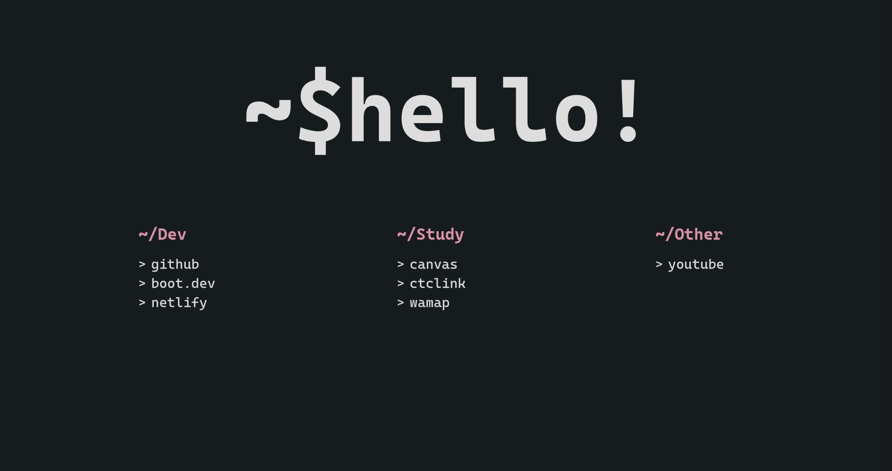
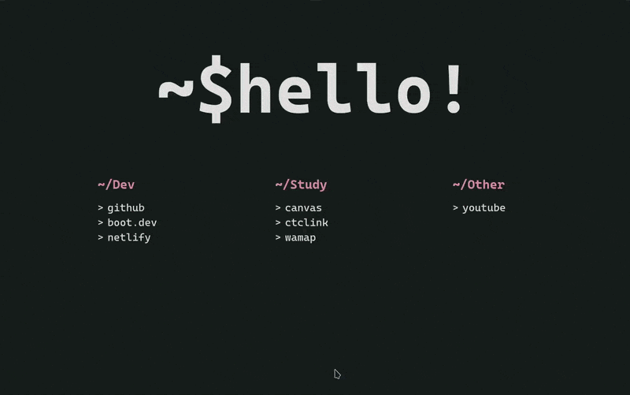
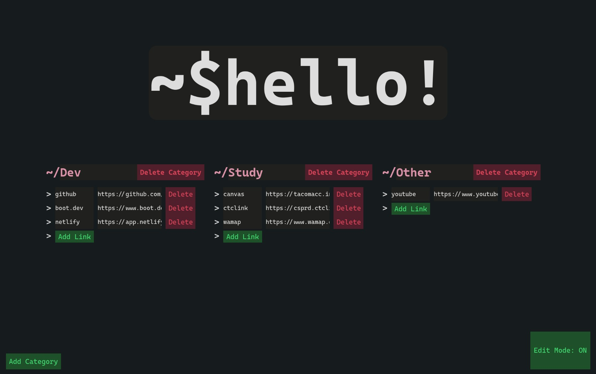

# StartPageBM v2

Replace your ads-filled default Home Page with this clean and minimal Start Page that is easy to customize.

**No data collected whatsoever.
Runs 100 % on client side and all data is stored locally.**

## Easy Configuration
Turn on Edit mode by using the hidden button at the lower right corner.

Have fun editing!

## Installation
It is hosted at ``https://startpagemino.netlify.app/``

Go to your browser ``Settings > Home > Set Homepage to use custom URLs, and paste the link``.

## Custom Hosting
If you are interested in building your own from source,
 
 `git clone https://github.com/BMHeades/StartPageBM2`\
 `npm i`\
 `npm run build`
